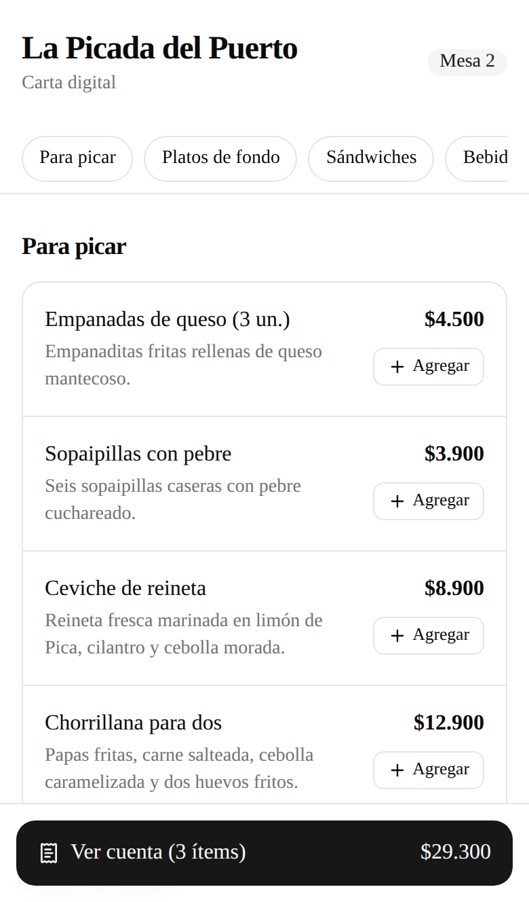
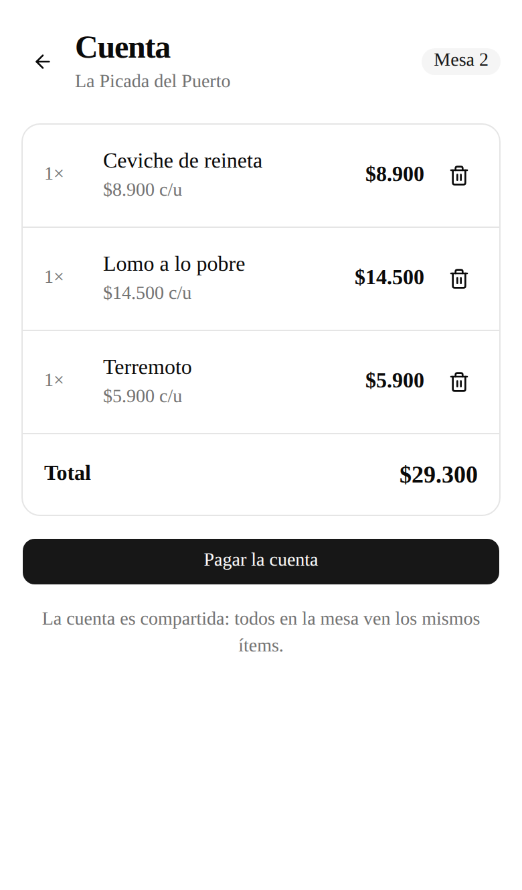
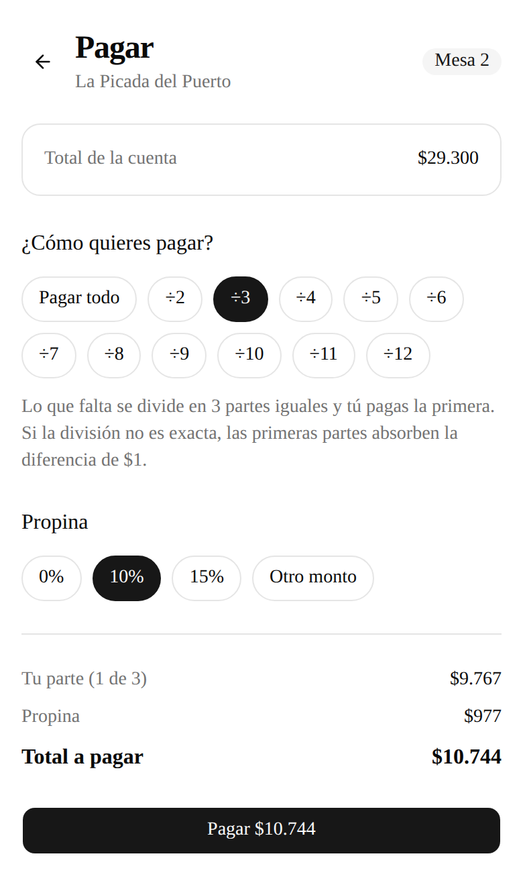
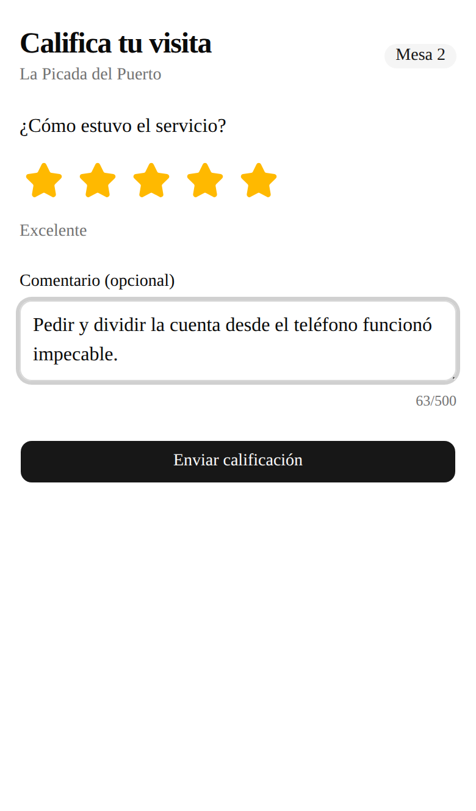
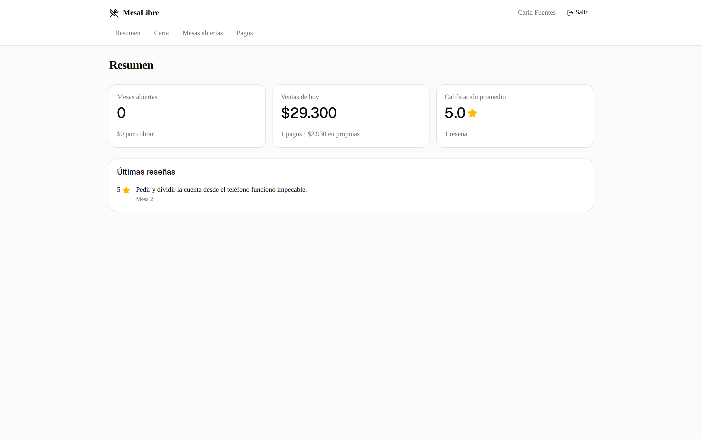
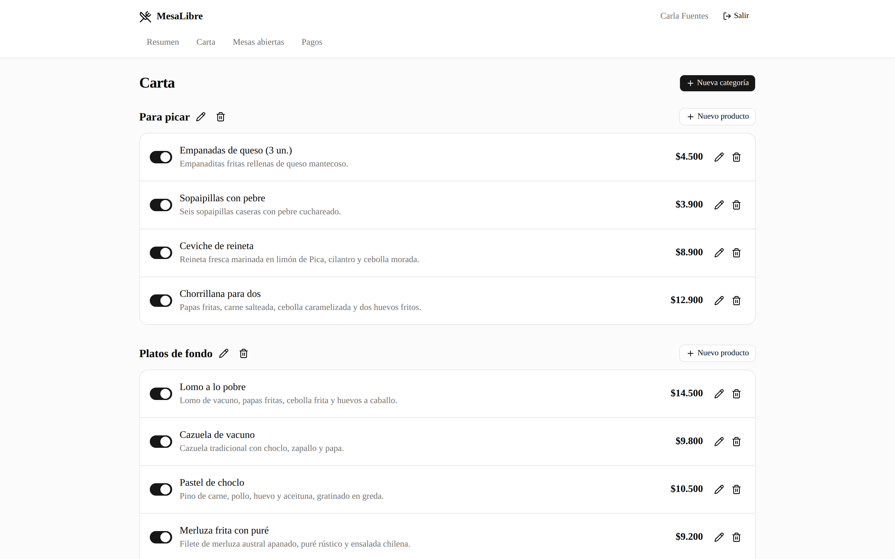
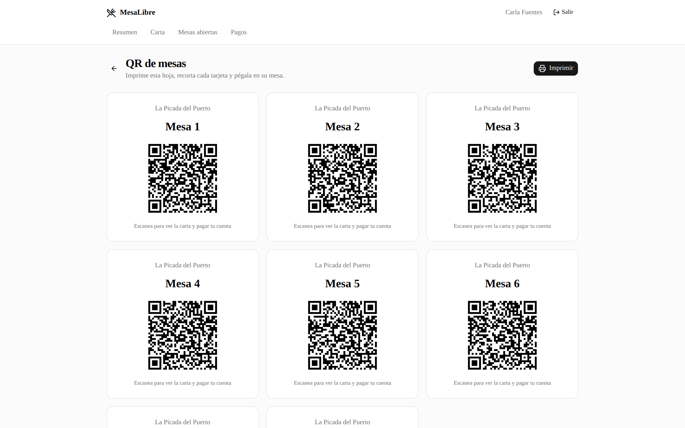
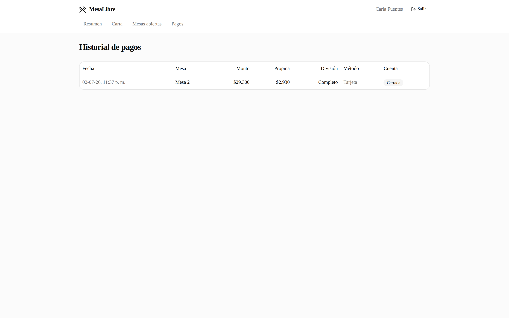
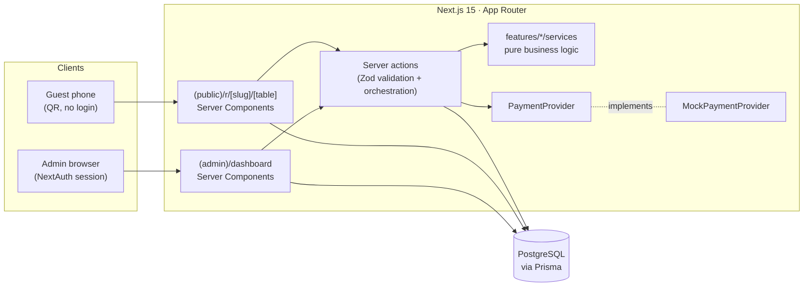
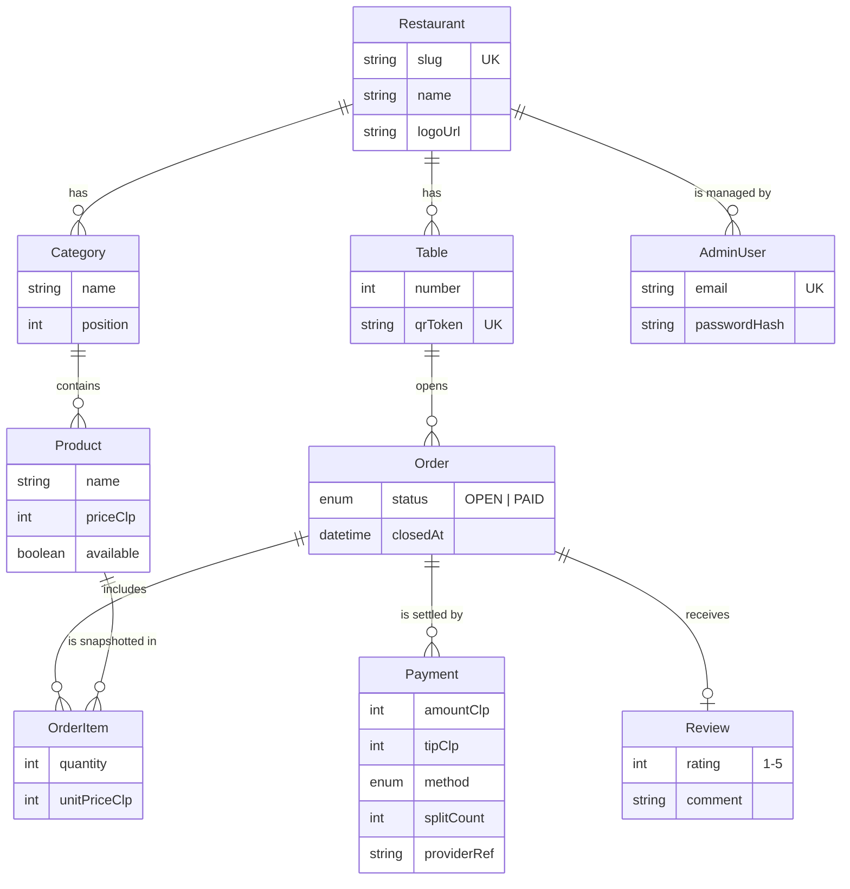

# MesaLibre

[](https://github.com/dev-tuga/MesaLibre/actions/workflows/ci.yml)

Pay-at-table platform for restaurants: guests scan a QR code on their table, browse the digital
menu, add items to a shared bill, split the payment between friends (with tip), and leave a review
— all from their phone, no app install required. Restaurant staff manage the menu, open tables and
payment history from an admin dashboard.

## Stack

- [Next.js 15](https://nextjs.org/) (App Router, React Server Components)
- TypeScript (strict mode)
- PostgreSQL 16 + [Prisma ORM](https://www.prisma.io/)
- Tailwind CSS 4 + [shadcn/ui](https://ui.shadcn.com/)
- [Zod](https://zod.dev/) for validation at every boundary
- NextAuth (credentials) for the admin panel
- Vitest for unit tests

## Screenshots

Guest flow (mobile):

| Menu                                                  | Shared bill                                                | Split payment                                        | Review                                                   |
| ----------------------------------------------------- | ---------------------------------------------------------- | ---------------------------------------------------- | -------------------------------------------------------- |
|  |  |  |  |

Admin panel (desktop):

| Overview                                               | Menu CRUD                                     |
| ------------------------------------------------------ | --------------------------------------------- |
|       |  |
| **Printable QR sheet**                                 | **Payment history**                           |
|  |  |

## Getting started

Requirements: Node 22+, pnpm 10+, Docker (for the local database).

```bash
# 1. Install dependencies
pnpm install

# 2. Start PostgreSQL
docker compose up -d

# 3. Configure environment variables
cp .env.example .env

# 4. Apply migrations and seed demo data
pnpm db:migrate
pnpm db:seed

# 5. Run the dev server
pnpm dev
```

The app is available at [http://localhost:3000](http://localhost:3000). The seed creates the demo
restaurant **La Picada del Puerto** with 8 tables; the table URLs are printed to the console, e.g.
`/r/la-picada-del-puerto/demo-mesa-1-7f3k`.

The admin panel lives at `/dashboard` (login at `/login`). The seed creates a demo admin:
`admin@lapicada.cl` / `picada-demo-2026`. Remember to set a real `AUTH_SECRET` in `.env`
(`openssl rand -base64 32`).

## Mobile testing on your LAN

To try the guest flow from a real phone (scan the QR, order, pay), the phone and your machine
must be on the same WiFi network:

1. **Find your machine's local IP.**
   - Windows: `ipconfig` → look for "IPv4 Address" (e.g. `192.168.1.50`).
   - macOS/Linux: `ifconfig` or `ip addr` → the `192.168.x.x` / `10.x.x.x` address of your
     WiFi interface.
2. **Point the base URL at that IP** in `.env`, so generated table links and QR codes use it:

   ```bash
   NEXT_PUBLIC_APP_BASE_URL="http://192.168.1.50:3000"
   ```

3. **Run the dev server bound to all interfaces:**

   ```bash
   pnpm dev:lan
   ```

4. **Open the firewall if needed.** If the phone cannot reach the app, allow inbound TCP 3000
   (Windows Defender: allow Node.js on private networks; Linux: `sudo ufw allow 3000/tcp`).
5. **Scan a table QR** from `/dashboard/mesas` (or use a URL printed by `pnpm db:seed`) and the
   phone lands directly on that table's menu.

Admin login also works over the LAN IP: sessions are host-agnostic (`trustHost` is enabled, see
ADR-010), so no extra auth configuration is needed in development.

## Scripts

| Script              | Description                    |
| ------------------- | ------------------------------ |
| `pnpm dev`          | Dev server with Turbopack      |
| `pnpm build`        | Production build               |
| `pnpm lint`         | ESLint                         |
| `pnpm format`       | Format the codebase (Prettier) |
| `pnpm format:check` | Check formatting               |
| `pnpm test`         | Unit tests (Vitest)            |
| `pnpm db:migrate`   | Prisma migrations (dev)        |
| `pnpm db:seed`      | Seed demo data (idempotent)    |
| `pnpm db:studio`    | Prisma Studio                  |

## Architecture



Data model:



Feature-based structure with thin layers:

```
src/
├── app/
│   ├── (public)/r/[slug]/[table]/   # guest-facing menu & bill
│   ├── (admin)/dashboard/           # restaurant admin panel
│   └── api/
├── features/{menu,orders,payments,feedback,tables}/
│   ├── components/
│   ├── actions/      # server actions: validate (Zod) + orchestrate only
│   ├── services/     # business logic as pure functions, no direct I/O
│   └── schemas/
├── lib/              # prisma singleton, env.ts (Zod), utils
└── components/ui/    # shadcn/ui primitives
```

Ground rules:

- Business logic lives only in `services/` (pure, unit-testable functions).
- Server Components by default; `"use client"` only where there is real interactivity.
- Payments go through a `PaymentProvider` interface (mock implementation today, designed to plug
  in Fintoc/Transbank later).
- Prices are stored in CLP as integers — no decimals, no floats.
- Types are derived from Prisma and `z.infer`, never duplicated by hand.

Design decisions are recorded in [docs/decisions.md](docs/decisions.md).

## License

[MIT](LICENSE)
